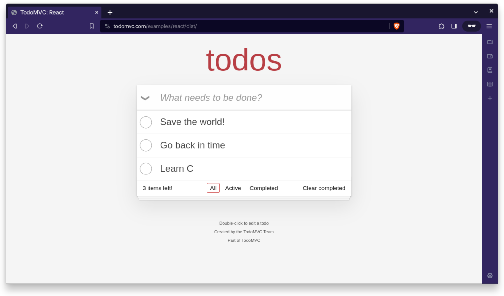

# Playwright End-to-End Testing Demo

The repo holds the React variant of the popular [TodoMVC](https://todomvc.com/)
application. It's used here to demonstrate end-to-end testing with
[Playwright](https://playwright.dev).

**Tutorial**:
[A Step by Step Guide to Playwright End-to-End testing](https://betterstack.com/community/guides/testing/playwright-end-to-end-testing)



## 🟢 Prerequisites

- [A recent version of Node.js](https://nodejs.org/en/download), preferably the
  latest LTS.

## 📦 Getting started

- Clone this repository to your local machine:

```bash
git clone https://github.com/betterstack-community/react-todo-mvc
```

- Change into the project directory, and install the dependencies:

```bash
cd react-todo-mvc
```

```bash
npm install
```

- Start the development server on port 8080:

```bash
npm run dev
```

- Open http://127.0.0.1:8080 in your browser to view and interact with the
  application.

- [Follow the tutorial](<(https://betterstack.com/community/guides/testing/playwright-end-to-end-testing)>)
  to learn how to write and execute end-to-end tests for the application with
  Playwright.

## ⚖ License

The code used in this project and in the linked tutorial are licensed under the
[Apache License, Version 2.0](LICENSE)
